# Ex-03EDA

## AIM
To perform EDA on the given data set. 

# Explanation
The primary aim with exploratory analysis is to examine the data for distribution, outliers and 
anomalies to direct specific testing of your hypothesis.
 

# ALGORITHM
### STEP 1:
Import the required packages(pandas,numpy,seaborn).
### STEP 2:
Read the given csv file.
### STEP 3:
Convert the file into a dataframe and get information of the data.
### STEP 4:
Remove the non numerical data columns using drop() method.
### STEP 5:
Replace the null values using (.fillna).
### STEP 6:
returns object containing counts of unique values using (value_counts()).
### STEP 7:
Plot the counts in the form of Histogram or Bar Graph.
### STEP 8:
find the pairwise correlation of all columns in the dataframe(.corr()).
### STEP 9:
Save the final data set into the file.


# CODE:
```
'''
Developed By: Jegathish s
Register No: 212221230041
'''
import pandas as pd
import numpy as np
import seaborn as sns
df=pd.read_csv("")
df.info()
df.head()
df.isnull().sum()
df.drop("Cabin",axis=1,inplace=True)
df.info()
df.isnull().sum()
df["Age"]=df["Age"].fillna(df["Age"].median())
df.boxplot()
df.isnull().sum()
df["Embarked"]=df["Embarked"].fillna(df["Embarked"].mode()[0])
df["Embarked"].value_counts()
df["Pclass"].value_counts()
df["Survived"].value_counts()
sns.countplot(x="Survived",data=df)
sns.countplot(x="Pclass",data=df)
sns.countplot(x="Sex",data=df)
df.info()

sns.displot(df["Fare"])
sns.countplot(x="Pclass",hue="Survived",data=df)
sns.displot(df[df["Survived"]==0]["Age"])
pd.crosstab(df["Pclass"],df["Survived"])
pd.crosstab(df["Sex"],df["Survived"])
df.corr()
sns.heatmap(df.corr(),annot=True)
```
# OUPUT:
## Read Data:
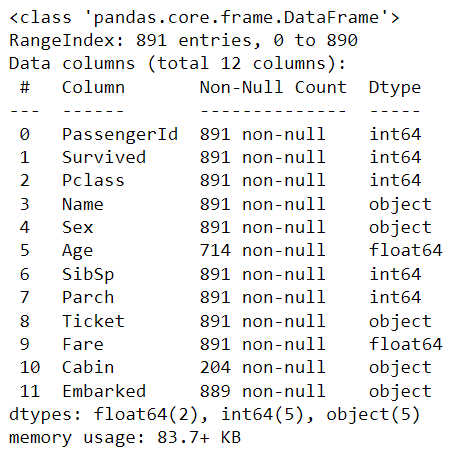
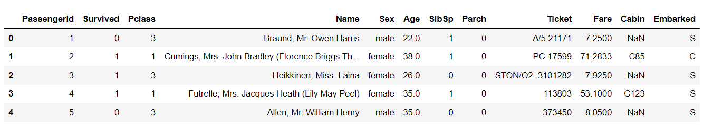
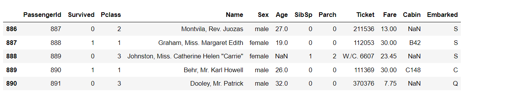
## Checking Null Values:
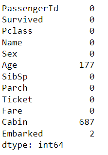
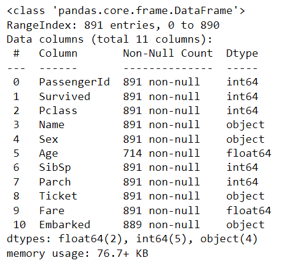
## Null values With Outliers:
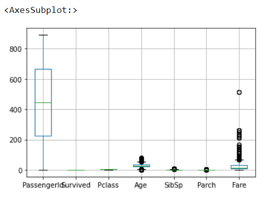

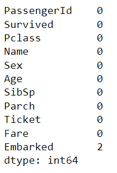
## Replacing the Null values:
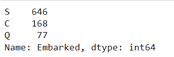

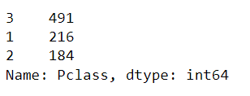

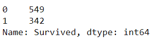
## Ploting Graphs:
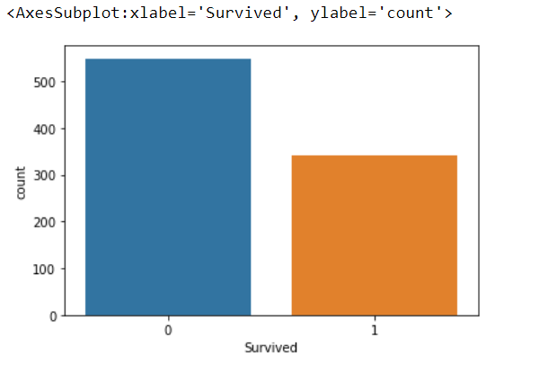
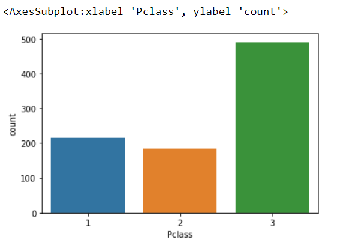

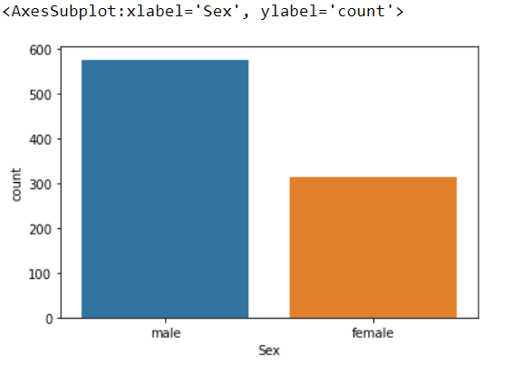
## After Replacing Null Values:
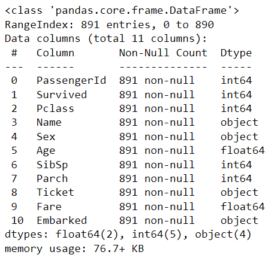

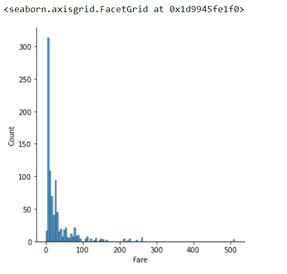

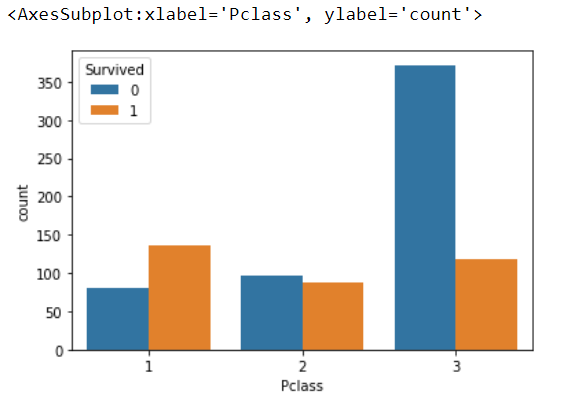

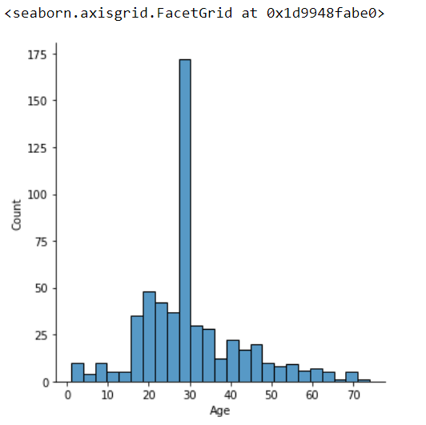

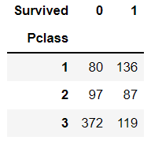

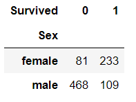
## Correlation between data's:
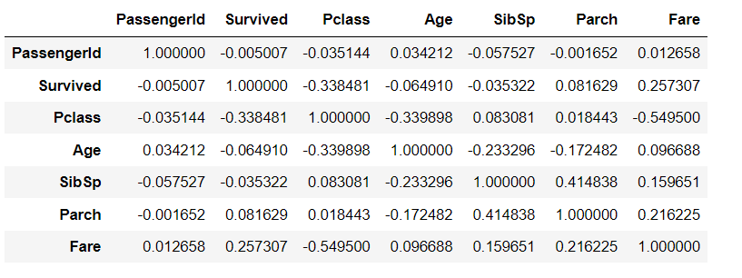
## HeatMap:
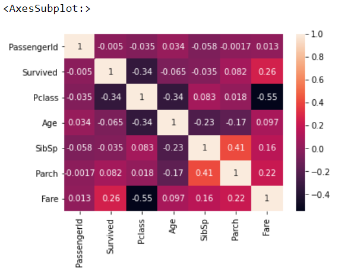

## Result:
Thus the EDA on the given data set is sucessfully done.